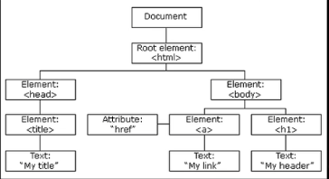

## JS NO BROWSER  
### IIFE - Passando parâmetros
  Basicamente estávamos falando sobre passar parâmetros para a IIFE. A ideia é que você possa passar parâmetros para a IIFE que são globais na sua aplicação, para acessá-los de forma local, dentro da IIFE. Já vimos que, em Javascript, o escopo é a função em que o código está inserido, correto?   
  Sempre que criarmos uma variável fora de uma função, é possível acessá-la dentro de qualquer função que esteja no mesmo escopo. O mesmo não acontece para variáveis criadas dentro de funções. Sempre que você cria uma variável dentro de uma função, essa variável não está acessível fora dela.  
  E qualquer variável criada dentro de uma função, que tenha o mesmo nome de uma variável criada fora dessa função (em escopo global), a variável mais interna terá precedência sobre a variável externa.
Um exemplo seria o seguinte:

```JS
var name = 'daciuk';
function myFunction() {
  var name = 'arroz';
  console.log( name ); // 'arroz'
}
console.log( name ); // 'daciuk'

```
Veja que, no código acima, temos duas variáveisname : uma criada dentro da função, e outra criada fora da função. Quando você usa o console.log dentro da função, é mostrado o valor da variável interna. E quando você chama o console.log fora da função, o valor é da variável externa. Ou seja: dentro da função, ainda que você crie uma variável com o mesmo nome da variável de fora, essa terá precedência. Simples, não?  
Agora, sobre a IIFE: quando temos objetos globais, nós podemos passar por parâmetro para a IIFE, para que esses parâmetros sejam uma representação do objeto externo (global), mas usados de forma local. Isso tem várias vantagens que veremos em alguma aula futura, como minificação de código, por exemplo :)  
Mas a ideia é: sempre que você tiver objetos globais, e precisar usar dentro da IIFE, não use diretamente o objeto global. Passe-o por parâmetro, e use-o como uma referência local:

```
(function(win) {
  console.log( win === window );
})(window);
```
O código acima mostra uma mensagem no consoletrue , pois win  é uma referência local ao objeto window  global.  
O outro assunto do qual falamos nesses 5 minutos foi sobre como podemos utilizar if s de uma única linha sem a necessidade das chaves.  
Nos nossos códigos, nós vamos procurar evitar ao máximo utilizar if s. E, sempre que necessário, vamos ao máximo evitar else, pois isso deixa o código mais complexo e difícil de entender.  
E sempre que utilizarmos if, vamos tentar manter o código dentro do if  pequeno, com no máximo uma única linha (não se preocupe, vou mostrar como podemos fazer isso na maior parte dos casos em breve :D).  
E para esses casos, sempre que usarmos ifs de uma única linha, nós podemos simplificar o seu uso, removendo as chaves. O mesmo vale para while e for. Vou mostrar alguns exemplos:

```
(function(win) {
  if( win === window )
    console.log( 'win é uma referência local à window' );
})(window);
```
Executando o código acima, você poderá ver que a mensagem win é uma referência local à window é mostrada no console, pois a condição é válida (é avaliada como true).  
Para garantir que está realmente funcionando, inverta a condição:

```
(function(win) {
  if( win !== window )
    console.log( 'win é uma referência local à window' );
})(window);
```
Agora nada é logado no console!  
E para ver que, sem as chaves, só a primeira linha é avaliada, você pode testar o seguinte:

```
(function(win) {
  if( win !== window )
    console.log( 'win é uma referência local à window' );
    console.log( 'Essa mensagem sempre é mostrada' );
})(window);
```
Dê uma olhada na indentação: parece que os dois console.log estão dentro do if, mas na verdade, como ele está sem as chaves, somente o primeiro será avaliado dentro do if. A outra mensagem sempre será mostrada!

Vamos tomar muito cuidado ao utilizar if  de uma única linha, por conta da dificuldade de leitura que isso pode causar, mas mantendo nossas funções pequenas, isso dificilmente será um problema. Tudo depende do código onde você irá aplicar essa regra. Se você tem uma função muito grande (mais de 8 linhas), então esse formato pode começar a se tornar um problema.


#Metodos  de window

prompt
```js
var name = prompt('pergunta?')
if(name)
  console.log('Ola',name);
else
  console.log('nao respondeu');

console.log('sempre');
```

Confirm
```js
var del = Confirm('Deseja realmete excluir');
if(del)
  console.log("Excluido com sucesso", del );
else {
  console.log('Ação cancelada',del);
}
```
# DOM - Document object Model
  

* ####  Utilizar "$" para declarar variaveis referente ao DOM  
 ## Selecioando elementos

```js
console.log(doc.getElementsByClassName('my-link'));// Pega elementos pela class
console.log(doc.getElementById("meu-id"));// Pega elementos pelo ID
console.log(doc.getElementsByTagName('p'));// Pega elementos pela TAG

console.log(doc.querySelector('.input'));// Pega o primeiro elemento pelo seletor CSS
// <input type="password" name="password" class="input"/>
console.log(doc.querySelectorAll('.input'));// Pega o primeiro pelo seletor CSS

// "$" se refere a um elemento da DOM
var $inputs = doc.getElementsByTagName('input');
```


# Formulários

### Pegar valores de inputs

.value
```js
var $inputUsername = doc.querySelector('#username');
var $inputPassword = doc.querySelector('#password'); // getter, esta pegando o valor do campo

$inputUsername.value = "matheus"; // setter, esta atribuindo  um valor;
$inputPassword.value = "senha";  // setter, esta atribuindo  um valor;

```

# Introdução á eventos

.addEventListener();  
.addEventListener('click');

```js
var $button = doc.querySelector('button');
button.addEventListener('click',function(event){
 $inputUsername.value = ""; // Limpando campos
 $inputPassword.value = ""; // Limpando campos
    event.preventDefault();
    console.log('Click no botao');
}, false);
```
