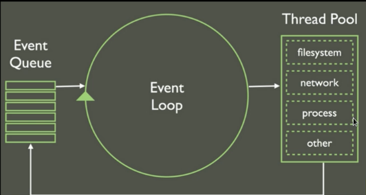

# Sync vs Async

Síncrona um comando após o outro   
Assíncrona, quando é necessário aguardar


Event loop
  

* setTimeout  
```js
  setTimeout(function(){
    alert("");
  },1000)
```  
 setInterval -  ele vai repetir a função.   
```js
setInterval(function(){
  alert("");
},1000)
```

Como parar o setTImeout  
```js
  var counter = 0;
  var $button = doc.querySelector('[data-js="button"]');
  var temporizador;
  function timer(){
    console.log('timer',1000);
  }
  timer();

  $button.addEventListener('click',funfunction(){
    clearTimeout(temporizador);
  },false);
```
